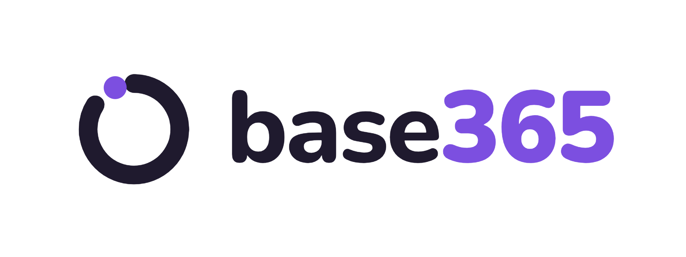

<p align="center">
  
</p>

<h1 align="center">Base365</h1>

<p align="center"><strong>Enterprise AI Agent Platform</strong></p>

<p align="center">
Multi-agent AI gateway built in Go. 20+ LLM providers. 7 channels. Multi-tenant PostgreSQL.<br/>
Single binary. Production-tested. Agents that orchestrate for you.
</p>

<p align="center">
  <a href="https://edyocampos.github.io/base365">Documentation</a> •
  <a href="https://edyocampos.github.io/base365/#quick-start">Démarrage rapide</a> •
  <a href="https://x.com/nlb_io">Twitter / X</a>
</p>

<p align="center">
  <a href="https://go.dev/"></a>
  <a href="https://www.postgresql.org/"></a>
  <a href="https://www.docker.com/"></a>
  <a href="https://developer.mozilla.org/en-US/docs/Web/API/WebSocket"></a>
  <a href="https://opentelemetry.io/"></a>
  <a href="https://www.anthropic.com/"></a>
  <a href="https://openai.com/"></a>
  
</p>

**Base365** est une passerelle IA multi-agents qui connecte les LLMs à vos outils, canaux et données — déployée comme un binaire Go unique sans dépendances d'exécution. Elle orchestre des équipes d'agents et la délégation inter-agents auprès de plus de 20 fournisseurs LLM avec une isolation multi-tenant complète.

🌐 **Langues :**
[🇺🇸 English](../README.md) ·
[🇨🇳 简体中文](README.zh-CN.md) ·
[🇯🇵 日本語](README.ja.md) ·
[🇰🇷 한국어](README.ko.md) ·
[🇻🇳 Tiếng Việt](README.vi.md) ·
[🇪🇸 Español](README.es.md) ·
[🇧🇷 Português](README.pt.md) ·
[🇫🇷 Français](README.fr.md) ·
[🇩🇪 Deutsch](README.de.md) ·
[🇷🇺 Русский](README.ru.md)
## Ce qui le différencie

- **Équipes d'agents et orchestration** — Équipes avec tableaux de tâches partagés, délégation inter-agents (sync/async), et découverte hybride d'agents
- **PostgreSQL multi-tenant** — Espaces de travail par utilisateur, fichiers de contexte par utilisateur, clés API chiffrées (AES-256-GCM), sessions isolées
- **Binaire unique** — Binaire Go statique de ~25 Mo, sans runtime Node.js, démarrage en <1 s, fonctionne sur un VPS à 5 $
- **Sécurité de niveau production** — Système de permissions à 5 couches (auth passerelle → politique d'outils globale → par agent → par canal → propriétaire uniquement) plus limitation de débit, détection d'injection de prompt, protection SSRF, motifs de refus shell, et chiffrement AES-256-GCM
- **Plus de 20 fournisseurs LLM** — Anthropic (HTTP+SSE natif avec mise en cache des prompts), OpenAI, OpenRouter, Groq, DeepSeek, Gemini, Mistral, xAI, MiniMax, Cohere, Perplexity, DashScope, Bailian, Zai, Ollama, Ollama Cloud, Claude CLI, Codex, ACP, et tout endpoint compatible OpenAI
- **7 canaux de messagerie** — Telegram, Discord, Slack, Zalo OA, Zalo Personal, Feishu/Lark, WhatsApp
- **Extended Thinking** — Mode de réflexion par fournisseur (jetons budget Anthropic, effort de raisonnement OpenAI, budget de réflexion DashScope) avec support du streaming
- **Heartbeat** — Vérifications périodiques des agents via des listes de contrôle HEARTBEAT.md avec suppression en cas de succès, heures actives, logique de réessai, et livraison par canal
- **Planification et Cron** — Expressions `at`, `every`, et cron pour les tâches d'agents automatisées avec concurrence par voie
- **Observabilité** — Traçage intégré des appels LLM avec spans et métriques de cache de prompts, export OpenTelemetry OTLP optionnel

## L'écosystème Claw

|                 | **Base365**                              |
| --------------- | --------------------------------------- |
| Langage        | **Go**                                  |
| Taille du binaire     | **~25 Mo** (base) / **~36 Mo** (+ OTel) |
| Image Docker    | **~50 Mo** (Alpine)                     |
| RAM (inactif)      | **~35 Mo**                              |
| Démarrage         | **< 1 s**                               |
| Matériel cible | **VPS à 5 $+**                             |

| Fonctionnalité                    | **Base365**                     |
| -------------------------- | ------------------------------ |
| Multi-tenant (PostgreSQL)  | ✅                             |
| Intégration MCP            | ✅ (stdio/SSE/streamable-http) |
| Équipes d'agents                | ✅ Tableau de tâches + boîte aux lettres        |
| Renforcement de la sécurité         | ✅ Défense à 5 couches             |
| Observabilité OTel         | ✅ OTLP (balise de build opt-in)     |
| Mise en cache des prompts             | ✅ Anthropic + OpenAI-compat   |
| Graphe de connaissances            | ✅ Extraction LLM + traversal  |
| Système de compétences               | ✅ BM25 + pgvector hybride      |
| Planificateur par voie       | ✅ (main/subagent/team/cron)   |
| Canaux de messagerie         | 7+                             |
| Applications compagnons             | Tableau de bord web                  |
| Canvas en direct / Voix        | TTS (4 fournisseurs)              |
| Fournisseurs LLM              | **20+**                        |
| Espaces de travail par utilisateur        | ✅ (PostgreSQL)                |
| Secrets chiffrés          | ✅ AES-256-GCM en base de données           |

## Architecture

<p align="center">
  
</p>

## Démarrage rapide

**Prérequis :** Go 1.26+, PostgreSQL 18 avec pgvector, Docker (optionnel)

### Depuis les sources

```bash
git clone https://github.com/edyoCampos/base365.git && cd base365
make build
./base365 onboard        # Assistant de configuration interactif
source .env.local && ./base365
```

### Avec Docker

```bash
# Générer .env avec des secrets auto-générés
chmod +x prepare-env.sh && ./prepare-env.sh

# Ajouter au moins une BASE365_*_API_KEY dans .env, puis :
make up

# Tableau de bord web sur http://localhost:18790
# Vérification de santé : curl http://localhost:18790/health
```

Lorsque les variables d'environnement `BASE365_*_API_KEY` sont définies, la passerelle s'auto-configure sans invites interactives — détecte le fournisseur, exécute les migrations, et initialise les données par défaut.

> Pour les variantes de build (OTel, Tailscale, Redis), les tags d'images Docker, et les overlays compose, voir le [Guide de déploiement](https://edyocampos.github.io/base365/#deploy-docker-compose).

## Orchestration multi-agents

Base365 prend en charge les équipes d'agents et la délégation inter-agents — chaque agent s'exécute avec sa propre identité, ses outils, son fournisseur LLM, et ses fichiers de contexte.

### Délégation d'agents

<p align="center">
  
</p>

| Mode | Fonctionnement | Idéal pour |
|------|-------------|----------|
| **Sync** | L'agent A demande à l'agent B et **attend** la réponse | Recherches rapides, vérifications de faits |
| **Async** | L'agent A demande à l'agent B et **continue**. B annonce plus tard | Tâches longues, rapports, analyses approfondies |

Les agents communiquent via des **liens de permission** explicites avec contrôle de direction (`outbound`, `inbound`, `bidirectional`) et limites de concurrence au niveau de chaque lien et de chaque agent.

### Équipes d'agents

<p align="center">
  
</p>

- **Tableau de tâches partagé** — Créer, revendiquer, compléter, rechercher des tâches avec des dépendances `blocked_by`
- **Boîte aux lettres d'équipe** — Messagerie directe entre pairs et diffusions
- **Outils** : `team_tasks` pour la gestion des tâches, `team_message` pour la boîte aux lettres

> Pour les détails sur la délégation, les liens de permission, et le contrôle de concurrence, voir la [documentation des équipes d'agents](https://edyocampos.github.io/base365/#teams-what-are-teams).

## Outils intégrés

| Outil               | Groupe         | Description                                                  |
| ------------------ | ------------- | ------------------------------------------------------------ |
| `read_file`        | fs            | Lire le contenu des fichiers (avec routage FS virtuel)                 |
| `write_file`       | fs            | Écrire/créer des fichiers                                           |
| `edit_file`        | fs            | Appliquer des modifications ciblées aux fichiers existants                       |
| `list_files`       | fs            | Lister le contenu d'un répertoire                                      |
| `search`           | fs            | Rechercher le contenu des fichiers par motif                              |
| `glob`             | fs            | Trouver des fichiers par motif glob                                   |
| `exec`             | runtime       | Exécuter des commandes shell (avec flux d'approbation)              |
| `web_search`       | web           | Rechercher sur le web (Brave, DuckDuckGo)                           |
| `web_fetch`        | web           | Récupérer et analyser le contenu web                                  |
| `memory_search`    | memory        | Rechercher dans la mémoire à long terme (FTS + vecteur)                       |
| `memory_get`       | memory        | Récupérer des entrées de mémoire                                      |
| `skill_search`     | —             | Rechercher des compétences (BM25 + hybride d'embeddings)                      |
| `knowledge_graph_search` | memory  | Rechercher des entités et traverser les relations du graphe de connaissances   |
| `create_image`     | media         | Génération d'images (DashScope, MiniMax)                        |
| `create_audio`     | media         | Génération audio (OpenAI, ElevenLabs, MiniMax, Suno)         |
| `create_video`     | media         | Génération vidéo (MiniMax, Veo)                              |
| `read_document`    | media         | Lecture de documents (API Fichiers Gemini, chaîne de fournisseurs)           |
| `read_image`       | media         | Analyse d'images                                               |
| `read_audio`       | media         | Transcription et analyse audio                             |
| `read_video`       | media         | Analyse vidéo                                               |
| `message`          | messaging     | Envoyer des messages aux canaux                                    |
| `tts`              | —             | Synthèse texte-parole                                             |
| `spawn`            | —             | Lancer un sous-agent                                             |
| `subagents`        | sessions      | Contrôler les sous-agents en cours d'exécution                                    |
| `team_tasks`       | teams         | Tableau de tâches partagé (lister, créer, revendiquer, compléter, rechercher)    |
| `team_message`     | teams         | Boîte aux lettres d'équipe (envoyer, diffuser, lire)                         |
| `sessions_list`    | sessions      | Lister les sessions actives                                         |
| `sessions_history` | sessions      | Afficher l'historique des sessions                                         |
| `sessions_send`    | sessions      | Envoyer un message à une session                                    |
| `sessions_spawn`   | sessions      | Lancer une nouvelle session                                          |
| `session_status`   | sessions      | Vérifier le statut d'une session                                         |
| `cron`             | automation    | Planifier et gérer les tâches cron                                |
| `gateway`          | automation    | Administration de la passerelle                                           |
| `browser`          | ui            | Automatisation du navigateur (naviguer, cliquer, saisir, capture d'écran)       |
| `announce_queue`   | automation    | Annonce de résultats asynchrones (pour les délégations asynchrones)            |

## Documentation

Documentation complète sur **[edyocampos.github.io/base365](https://edyocampos.github.io/base365)** — ou consultez les sources dans [`base365-docs/`](https://edyocampos.github.io/base365)

| Section | Sujets |
|---------|--------|
| [Premiers pas](https://edyocampos.github.io/base365/#what-is-base365) | Installation, Démarrage rapide, Configuration, Visite du tableau de bord web |
| [Concepts fondamentaux](https://edyocampos.github.io/base365/#how-base365-works) | Boucle d'agent, Sessions, Outils, Mémoire, Multi-tenant |
| [Agents](https://edyocampos.github.io/base365/#creating-agents) | Créer des agents, Fichiers de contexte, Personnalité, Partage et accès |
| [Fournisseurs](https://edyocampos.github.io/base365/#providers-overview) | Anthropic, OpenAI, OpenRouter, Gemini, DeepSeek, +15 autres |
| [Canaux](https://edyocampos.github.io/base365/#channels-overview) | Telegram, Discord, Slack, Feishu, Zalo, WhatsApp, WebSocket |
| [Équipes d'agents](https://edyocampos.github.io/base365/#teams-what-are-teams) | Équipes, Tableau de tâches, Messagerie, Délégation et transfert |
| [Avancé](https://edyocampos.github.io/base365/#custom-tools) | Outils personnalisés, MCP, Compétences, Cron, Sandbox, Hooks, RBAC |
| [Déploiement](https://edyocampos.github.io/base365/#deploy-docker-compose) | Docker Compose, Base de données, Sécurité, Observabilité, Tailscale |
| [Référence](https://edyocampos.github.io/base365/#cli-commands) | Commandes CLI, API REST, Protocole WebSocket, Variables d'environnement |

## Tests

```bash
go test ./...                                    # Tests unitaires
go test -v ./tests/integration/ -timeout 120s    # Tests d'intégration (nécessite une passerelle en cours d'exécution)
```

## Statut du projet

Voir [CHANGELOG.md](CHANGELOG.md) pour le statut détaillé des fonctionnalités, y compris ce qui a été testé en production et ce qui est encore en cours.

## Licence

MIT
